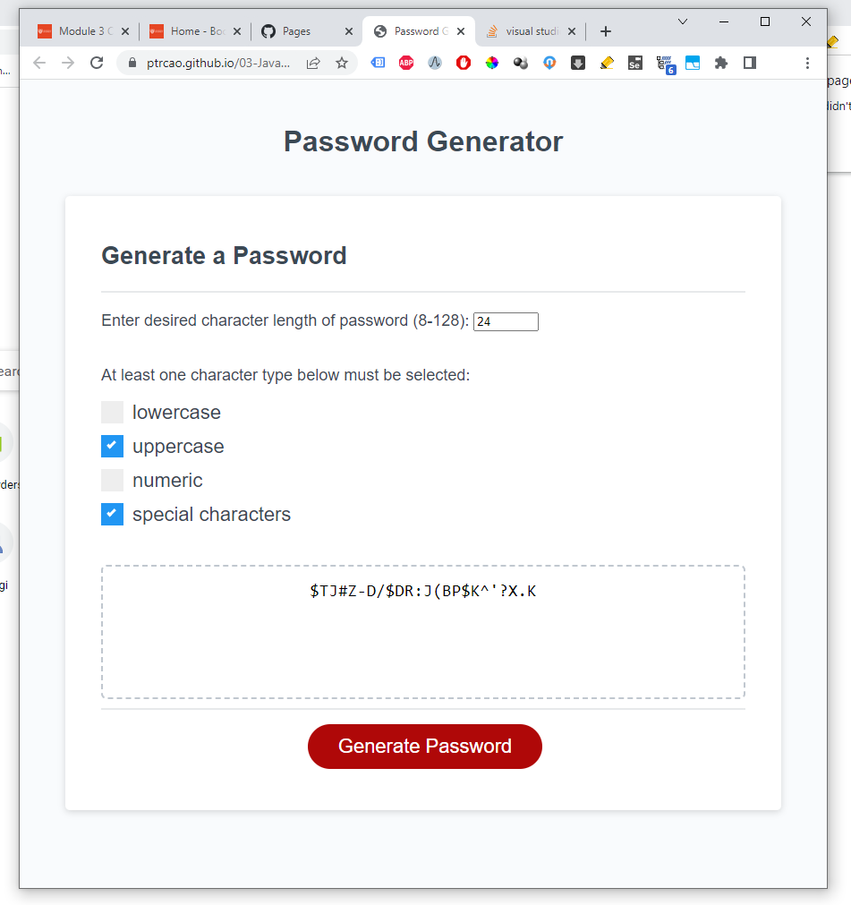

# Readme

> URL for password generator: <a href="https://ptrcao.github.io/03-JavaScript-02-Challenge/">https://ptrcao.github.io/03-JavaScript-02-Challenge/</a>

> URL to repository: <a href="https://github.com/ptrcao/03-JavaScript-02-Challenge.git">https://github.com/ptrcao/03-JavaScript-02-Challenge.git</a>

## Project Description

Included by the developer in this repository is a fully functional, Javascript-driven password generator.  It makes handy use of a html input field of <code>type="number"</code> to exclude irrelevant/invalid non-numerical/non-integer inputs for the password length.  The inclusion of <code>min</code> and <code>max</code> input attributes adds additional validation robustness when the user uses the default up and down arrows which appear on hover over the input element.  For validation, the password length value is compared against an array of acceptable inputs and a prompt to re-try is triggered when the user input cannot be matched against the validation array.

Secondly, the UI choice of a checkbox list for character types was chosen to avoid tiring the user with repeated windows prompts.  When at least one choice has not been made, a prompt to re-try is triggered.  Furthermore, it will be noted that the password generation .js code begins by randomly selecting one character from each character type set, before randomly choosing character types for the remaining password letters, thus satisfying the client requirement to select at least one character from each character type.

## Screenshot

## Acceptance Criteria

> GIVEN I need a new, secure password
> WHEN I click the button to generate a password
> THEN I am presented with a series of prompts for password criteria

&#9745; Implemented

> WHEN prompted for password criteria
> THEN I select which criteria to include in the password

&#9745; Implemented

> WHEN prompted for the length of the password
> THEN I choose a length of at least 8 characters and no more than 128 characters

&#9745; Implemented

> WHEN asked for character types to include in the password
> THEN I confirm whether or not to include lowercase, uppercase, numeric, and/or special characters

&#9745; Implemented

> WHEN I answer each prompt
> THEN my input should be validated and at least one character type should be selected

&#9745; Implemented

> WHEN all prompts are answered
> THEN a password is generated that matches the selected criteria

&#9745; Implemented

> WHEN the password is generated
> THEN the password is either displayed in an alert or written to the page

&#9745; Implemented